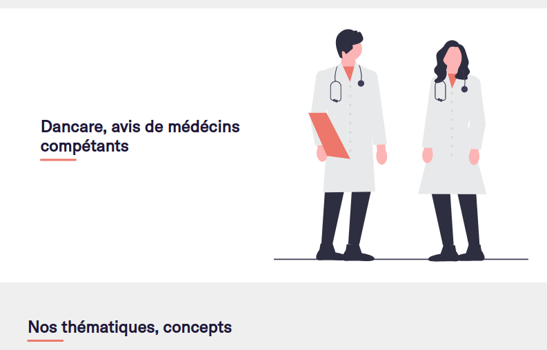
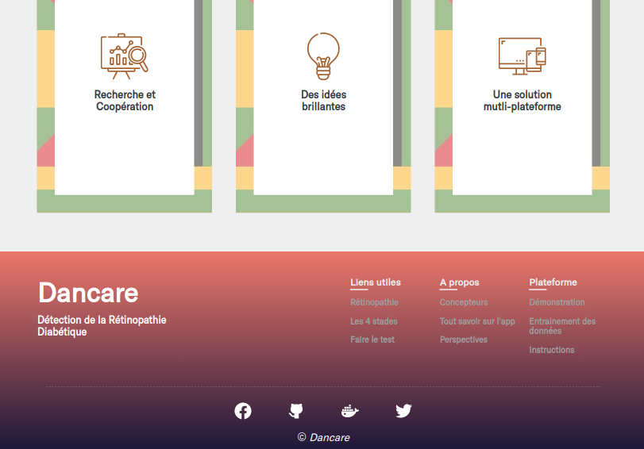
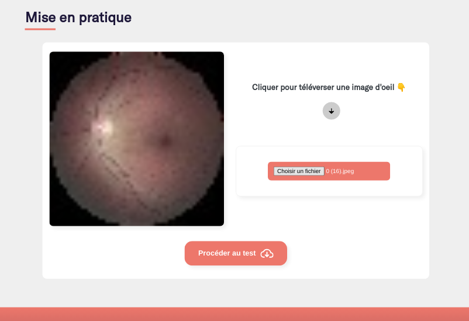
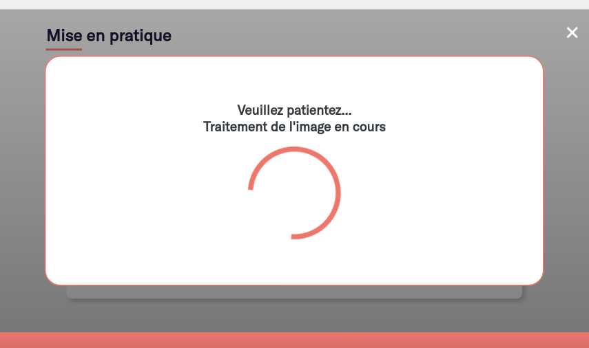

# Dancare, detection de la Rétinopathie Diabétique
 


## Introduction
*Dancare*, une platefome de Détection de la Rétinopathie Diabétique en utilisant le deep learning.


## Technos utilisées
*Python*, *Django*, *Tensorflow*, *Keras*, *PyTorch*, *Sass*, *JQuery*


## Contenu

**Page d'acceuil:** Présentation, 

**Page Fonctionnalités:** Modèles de données

**Page à propos:** Tout sur la plateforme

**Page Demo et Test:** Démo de la solution


## Captures d'écran

### Acceuil | Inteface prinpale
<p align = "left" >
  
   
   
   
</p>

### Fonctionnalités | Procédures
<p align = "left" >
  
   
</p>

### A propos | Tout 
<p align = "left" >
   
</p>

### Demonstration 
<p align = "left" >
  
   
   
   
   
   
</p>


## Mise en place du projet


### Cloner le projet
```
$ git clone https://github.com/fassane/dancare
```

### Création de l'environnement virtuel

#### Linux
```
$ cd dancare
$ python3 -m venv venv
$ source venv/bin/activate
```
#### Windows
```
$ cd dancare
$ pip install virtualenv
$ virtualenv venv
$ .\venv\Scripts\activate
```

### Installation des libraires
```
$ pip install pip --upgrade
$ pip intall setuptools --upgrade
$ pip install django
$ pip install -r requirements.txt
```


### Important

Présentement, les modèles ont été entrainé depuis les données de la compétiton
ATPOS sur kaggle https://www.kaggle.com/competitions/aptos2019-blindness-detection/data, Tensorflow également. 
Trouver ce modèle résultant dans `diab_retina_app/model`.


### Visualisation de la plateforme
```
$ python manage.py runserver
ou
$ python manage.py runserver 0.0.0.0:8000
ou
$ python manage.py runserver 0.0.0.0:port
```
Aller sur votre navigateur et taper `localhost:8000` ou `localhost:2100`, ou `adresse-ip:port` sur votre réseau local.


### Utilisation

Aller a la page de démo, téléverser une image d'oeil saine ou suceptible de
contenir des sequelles de *réthinopathie diabétique* et procéder au test.
Toutefois, nous vous conseillons d'utiliser les images du dossier 
`diab_retina_app/test`


## Aide et autres

#### Apports
Vous etes libre de télécharger le projet et le modifier comme bon vous semble

#### Aide
Pour tout, `fassanebolly@gmail.com` ou encore via
`ludvlavonou@gmail.com`

