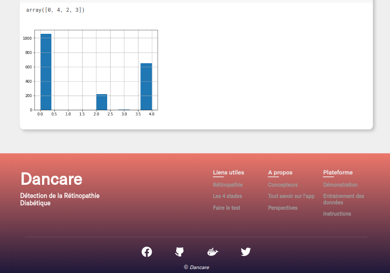
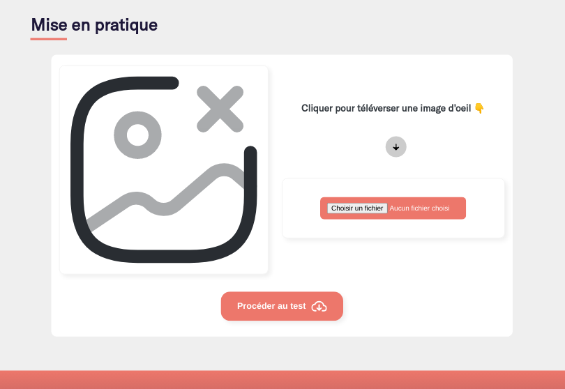

# Dancare, diabetic retinopathy detection
 


## Introduction
*Dancare*, a small web application to detect diabetic retinopathy using deep learning.


## Framework and librairies
*Python*, *Django*, *Tensorflow*, *Keras*, *PyTorch*, *Sass*, *JQuery*


## Content

**Home page:** Presentation, 

**Function page:** data models

**About page:** about plateform

**Demo and test page:** Solution


## Screenshoots

### Home page
<p align = "left" >
  
   
   
   
</p>

### Function page
<p align = "left" >
  
   
</p>

### About page
<p align = "left" >
   
</p>

### Demonstration page
<p align = "left" >
  
   
   
   
   
   
    
</p>


## Setup project

### Clone project
```
$ git clone https://github.com/fassane/dancare
```

### Create virtual environment

#### Linux
```
$ sudo apt install python3-venv
```
```
$ cd dancare
$ python3 -m venv venv
$ source venv/bin/activate
```
#### Windows
```
> python -m pip install virtualenv
```
```
> cd dancare
> virtualenv venv
> .\venv\Scripts\activate
```

### librairies Installation
```
$ pip install pip --upgrade
$ pip install setuptools --upgrade
$ pip install django
$ pip install -r requirements.txt
```


### Important

currently, the model has been trained with kaggle APTPOS competition datas https://www.kaggle.com/competitions/aptos2019-blindness-detection/data. Tensorflow too. <br/>
Find this model in **./dr_app/model**.


### Run application
```
$ python manage.py runserver
or
$ python manage.py runserver 0.0.0.0:8000
or
$ python manage.py runserver 0.0.0.0:port
```
Go to your browser and type **localhost:8000**, or **adresse-ip:port** on your local network.


### Usage

- **Go to demo page**
- **Upload an healthy eye image or not**
- **Start the test <br/>**
However, we recommand you use the images of **./dr_app/test** folder


## Conclusion

#### Open source
You are free to download the project and modify the logic as you wish 

#### Help
Reach me on `fassanebolly@gmail.com`

